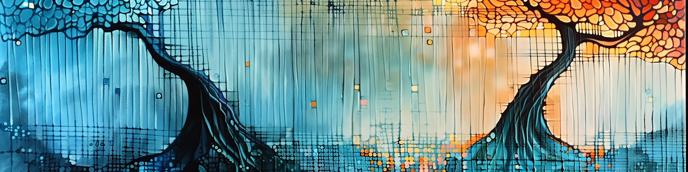

# Advanced Bayesian Learning - PhD course, 8 credits

### Course information

**The typical participant** is a PhD student in Statistics or related fields (Mathematical Statistics, Engineering Science, Quantitative Finance, Computer Science, ...). The participants are expected to have taken a basic course in Bayesian methods, for example [Bayesian Learning](https://github.com/mattiasvillani/BayesLearnCourse) at Stockholm University, and to have some experience with programming.

**Examination and Grades**: The course is graded Pass or Fail. Examination is through individual reports on distributed problems for each topic. Many of the problems will require computer implementations of Bayesian learning algorithms.

**Course organization**
The course is organized in four topics, each containing four lecture hours. Course participants will spend most of their study time by solving the problem sets for each topic on their own computers without supervision.

All lectures are given online using Zoom.

Welcome!

[**Mattias Villani**](https://www.mattiasvillani.com/)  
Professor of Statistics, Stockholm University

---

### Topic 1 - Gaussian processes regression and classification

Reading:  [Gaussian Processes for Machine Learning](http://www.gaussianprocess.org/gpml/chapters/RW.pdf) - Chapters 1, 2.1-2.5, 3.1-3.4, 3.7, 4.1-4.3. \
Code: [GPML for Matlab](http://mlg.eng.cam.ac.uk/carl/gpml/) | [GPy for Python](https://sheffieldml.github.io/GPy/) | [Gausspr in R](https://rdrr.io/cran/kernlab/man/gausspr.html) | [Gaussianprocesses.jl in Julia](https://github.com/STOR-i/GaussianProcesses.jl) | [GPyTorch - GPs in PyTorch](https://gpytorch.ai/) \
Other material: [Visualize GP kernels](http://www.it.uu.se/edu/course/homepage/apml/GP/)

**Lecture 1 - May 3, hours 10-12**  
[slides](/Slides/ABL1.pdf)  
**Lecture 2 - May 3, hours 13-15**  
[slides](/Slides/ABL2.pdf)

**Lab Topic 1**  
[Problems](/Labs/Lab1_v2024.pdf) | [Lidar data](/Labs/LidarData.dat)

---

### Topic 2 - Mixture models and Bayesian nonparametrics

Reading: [Bayesian Data Analysis](http://www.stat.columbia.edu/~gelman/book/BDA3.pdf) - Chapter 23 | [The Neal (2000) article on MCMC for Dirichlet Process Mixtures](http://www.stat.columbia.edu/npbayes/papers/neal_sampling.pdf)  

Widgets: [Dirichlet distribution](https://observablehq.com/@mattiasvillani/dirichlet-distribution) | [Bayes for multinomial data](https://observablehq.com/@mattiasvillani/multinomial-dirichlet) | [mixture of normals](https://observablehq.com/@mattiasvillani/normal-mixture) | [mixture of Poissons](https://observablehq.com/@mattiasvillani/mixture-of-poissons)

**Lecture 3 - May 17, hours 10-12**  
[slides](/Slides/ABL3.pdf)  
**Lecture 4 - May 17, hours 13-15**  
[slides](/Slides/ABL4.pdf) | [derivation marginal Gibbs](/Notes/MarginalGibbsDerivation.pdf)

**Lab Topic 2**  
[Problems](/Labs/Lab2_v2024.pdf) | [Galaxy data](/Labs/GalaxyData.dat)

---

### Topic 3 -  Variational inference

Reading: [Blei et al JASA](https://amstat.tandfonline.com/doi/abs/10.1080/01621459.2017.1285773#.XraDPXUzaLI) | [Tran's VI Notes](/Material/VBnotesMNT.pdf) \
Other material: [Kullback-Leibler widget](https://observablehq.com/@mattiasvillani/kl-divergence-continuous) | [My recent talk with some VI](https://github.com/mattiasvillani/Talks/raw/master/VillaniStatSUMarch2024.pdf) | [Natural gradient notes](https://wiseodd.github.io/techblog/2018/03/14/natural-gradient/) | [autograd in python](https://github.com/HIPS/autograd) | [ForwardDiff in Julia](https://github.com/JuliaDiff/ForwardDiff.jl)

**Lecture 5 - May 31, hours 10-12**  
[slides](/Slides/ABL5.pdf)  
**Lecture 6 - May 31, hours 13-15**  
[slides](/Slides/ABL6.pdf)

**Lab Topic 3**  
[Problems](/Labs/Lab3_v2024.pdf) | [Time series data](/Labs/timeseries.csv)

---

### Topic 4 - Bayesian regularization and variable selection

Reading: Sections 12.2-12.5 and 14.6 of [Bayesian Learning book](https://github.com/mattiasvillani/BayesianLearningBook/raw/main/pdf/BayesBook.pdf) | [Handbook chapter on variable selection](https://bpb-us-e1.wpmucdn.com/blogs.rice.edu/dist/0/5714/files/2022/06/book_chapter.pdf) | [Article on Bayesian regularization](https://wires.onlinelibrary.wiley.com/doi/full/10.1002/wics.1463?casa_token=TRIRvJPG7fAAAAAA%3AErexRs49LFd9QFMR5ZlGJ9RyWs9r7Q_Fc5Hird767zNVPf2CRfKC5O91y2isnLAGJub1yArfEt-RfJhH)

**Lecture 7 - Sept 6, hours 10-12**  
[slides](/Slides/ABL7.pdf)  
**Lecture 8 - Sept 6, hours 13-15**  
[slides](/Slides/ABL8.pdf)

**Lab Topic 4**  
[Problems](/Labs/Lab4.pdf) 